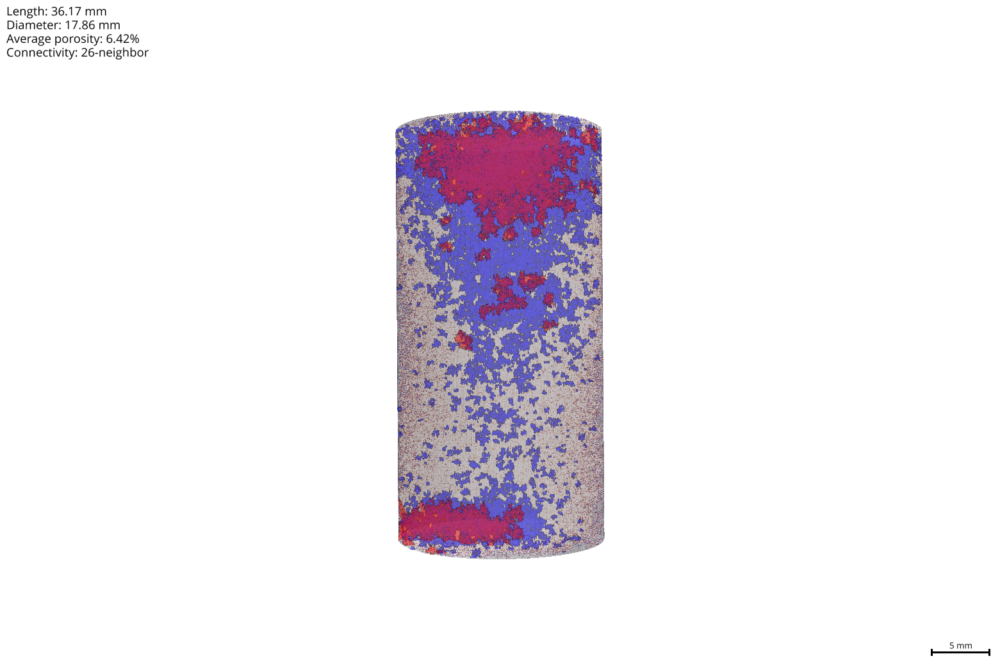
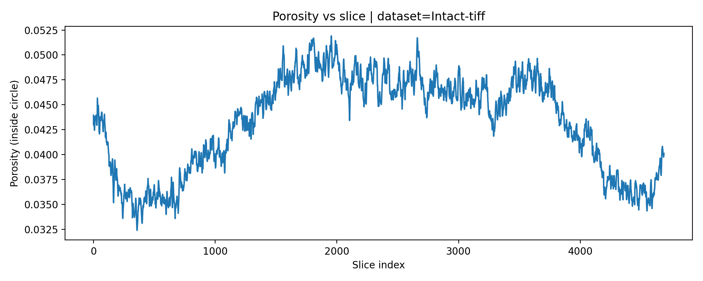
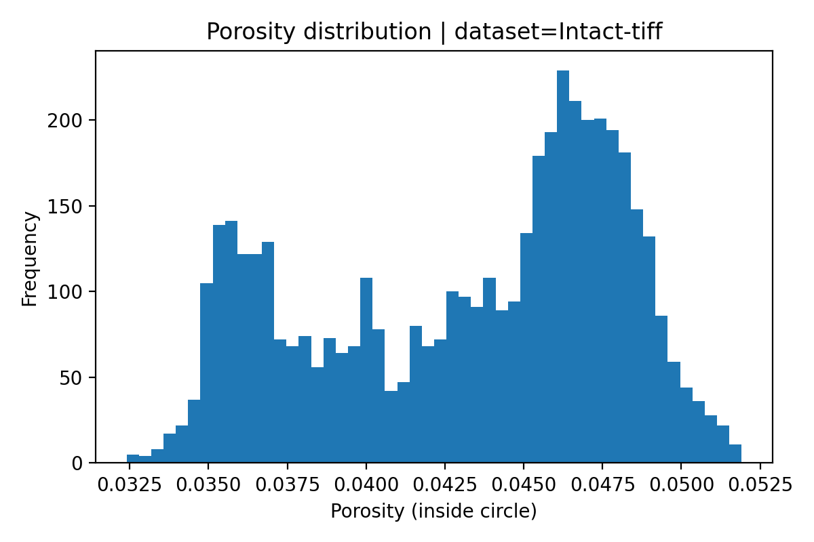

# PERCOLATE-V1

**Pore Extraction and Reconstruction for COre analysis and AnalyTical Evaluation**

A reproducible micro-CT workflow for pore segmentation, porosity quantification, pore size distribution (PSD), and physically scaled 3D visualization of cylindrical core samples.

---

## Example Results

### 3D Pore Size Distribution in a Cylindrical Core Sample (Micro-CT)

<p align="center">
  
</p>

Three-dimensional visualization of pore size classes derived from micro-CT data.
Colors represent equivalent pore radius classes from small (blue) to large (red).
Average porosity of the illustrated sample is approximately 6.4%. Pore size classes can be interactively visualized in the Napari viewer, 
where individual classes can be toggled on and off. 
In the static image shown above, all classes are displayed simultaneously, 
which may lead to visual overlap of smaller pores.

---

### Porosity Variation Along Core Axis

<p align="center">
  
</p>

Slice-by-slice porosity variation within the cylindrical core.
This highlights heterogeneity along the sample length.

---

### Porosity Distribution

<p align="center">
  
</p>

Histogram of porosity values across all slices.
The distribution reflects spatial variability in pore structure.

---

## Workflow

The PERCOLATE pipeline consists of four modular stages:

1. **Interactive Segmentation**

   * Crop definition
   * Cylindrical masking
   * Threshold selection

2. **Batch Segmentation**

   * Full stack processing
   * Binary pore mask generation
   * Porosity computation

3. **Pore Clustering and PSD Analysis**

   * Connected-component labeling
   * Equivalent pore radius estimation
   * Histogram generation

4. **3D Visualization**

   * Physically scaled rendering in Napari
   * Discrete color mapping
   * Sample geometry annotation

---

## Repository Structure

```text
PERCOLATE/
│
├── scripts/
│   ├── 01-Interactive-segmentation.py
│   ├── 02A-Batch-segmentation.py
│   ├── 02B-Pore-Clustering.py
│   └── 03-Visualizer-Pore-Clustering.py
│
├── figures/
│   ├── example_result.png
│   ├── porosity_vs_slice.png
│   └── porosity_distribution.png
│
├── data/
│   └── pore_size_histogram_preview.csv
│
├── example_dataset/
├── outputs/
├── requirements.txt
└── README.md
```

---

## Example Dataset

A reduced dataset (3 slices) is included for demonstration due to GitHub file size limitations.

* Format: TIFF stack
* Naming convention:
  `block00000019_z0000.tif`, `block00000019_z0001.tif`, ...
* Voxel size: ~7.14 µm
* Geometry: cylindrical core sample

---

## Output Data

Example outputs include:

* Pore masks (TIFF stack)
* Porosity values per slice
* Pore size distribution (CSV)
* 3D visualization volumes

The file:

`data/pore_size_histogram_preview.csv`

contains pore size distribution data derived from connected-component analysis.

---

## Installation

```bash
python -m venv venv
venv\Scripts\activate

pip install -r requirements.txt
```

---

## Usage

```bash
python 01-Interactive-segmentation.py
python 02A-Batch-segmentation.py
python 02B-Pore-Clustering.py
python 03-Visualizer-Pore-Clustering.py
```

---

## Notes and Limitations

* Pore sizes are based on equivalent radius approximations
* Sub-resolution pores may be merged due to resolution limits
* Results are most suitable for comparative analysis
* Visualization uses downsampled volumes for performance

---

## Citation

*PERCOLATE: Pore Extraction and Reconstruction for COre analysis and AnalyTical Evaluation*
URL:

---


## Acknowledgements

Developed for reproducible micro-CT analysis of porous geological materials.
